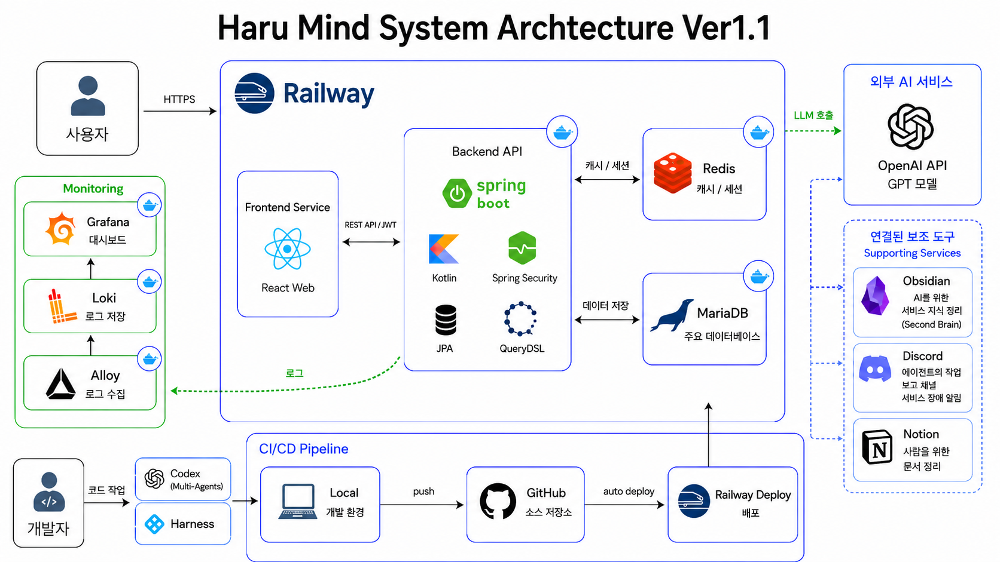
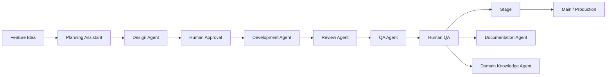

# Haru Mind

Haru Mind는 하루의 감정과 생각을 AI와 편안하게 나누고, 그 대화를 바탕으로 스스로를 더 잘 이해하도록 돕는 멘탈 케어 서비스입니다.

사용자는 매일 하나의 대화방에서 AI 마음 파트너와 대화할 수 있습니다. 대화는 하루 단위로 이어지고, 중요한 흐름은 요약되어 다음 대화의 맥락으로 다시 활용됩니다. 단순한 챗봇이 아니라, 사용자의 일상과 감정 흐름을 차분히 정리해 주는 개인적인 마음 기록 도구를 지향합니다.

## Why Haru Mind

많은 사람은 자신의 감정을 말로 정리할 시간이 부족합니다. 누군가에게 털어놓기에는 부담스럽고, 혼자 기록하기에는 막막한 순간도 있습니다.

Haru Mind는 그런 순간에 사용자가 부담 없이 말을 꺼낼 수 있는 작은 대화 공간을 제공합니다. 의료적 진단이나 치료를 대신하지 않고, 사용자가 자신의 감정을 돌아보고 오늘의 마음을 정리하도록 돕는 데 집중합니다.

## Core Experience

- **AI 마음 대화**: 사용자는 AI 마음 파트너와 짧고 따뜻한 대화를 나눌 수 있습니다.
- **하루 단위 대화방**: 같은 날의 대화는 하나의 흐름으로 이어집니다.
- **대화 요약 메모리**: 최근 대화뿐 아니라 하루의 중요한 맥락을 요약해 다음 응답에 활용합니다.
- **감정 리포트**: 하루 대화를 바탕으로 사용자의 상태를 쉽게 돌아볼 수 있게 정리합니다.
- **회원 기반 서비스**: 회원가입, 로그인, 토큰 재발급, 프로필 조회 등 기본 인증 흐름을 갖추었습니다.
- **운영 알림**: AI 응답 실패 같은 운영 이슈는 Discord 알림으로 빠르게 확인할 수 있습니다.

## Service Architecture

Haru Mind는 프론트엔드, 백엔드, 데이터베이스, 캐시, 외부 AI 서비스를 분리한 구조로 설계했습니다. 사용자는 Railway에 배포된 웹 서비스에 접속하고, 웹은 Spring Boot API 서버와 통신합니다. 대화 데이터는 MariaDB에 저장되며, 인증 토큰과 세션성 데이터는 Redis를 사용합니다. AI 응답은 OpenAI API를 통해 생성됩니다.



## Tech Stack

| Area | Stack |
|---|---|
| Frontend | Next.js, React, TypeScript |
| Backend | Kotlin, Spring Boot, Spring Security |
| Database | MariaDB, Flyway |
| Cache / Session | Redis |
| AI | OpenAI API |
| Deployment | Railway |
| Monitoring | Railway Logs, Grafana/Loki/Alloy(local) |
| Documentation | Notion, Obsidian |

## Backend Design

백엔드는 Kotlin과 Spring Boot를 기반으로 구성했습니다. 단순히 API를 빠르게 만드는 것보다, 기능이 늘어나도 구조를 유지할 수 있도록 DDD와 헥사고날 아키텍처의 원칙을 참고했습니다.

컨트롤러는 요청과 응답을 다루는 얇은 계층으로 유지하고, 실제 비즈니스 흐름은 Input Port와 Service 계층을 통해 처리합니다. 데이터 저장소나 외부 연동은 어댑터로 분리해, 도메인 흐름과 인프라 구현이 강하게 섞이지 않도록 했습니다.

또한 운영 중 문제가 생겼을 때 원인을 추적할 수 있도록 로그에는 `who`, `what`, `requestData`, `reason` 같은 고정된 키를 사용합니다. 사용자가 보는 메시지는 안전하고 이해하기 쉬운 한국어로 제공하고, 내부 로그는 원인 분석에 필요한 정보를 남기는 방향으로 설계했습니다.

## AI Development Harness

이 프로젝트는 직접 만든 AI 개발 하네스를 통해 설계, 구현, 리뷰, QA, 문서화를 관리했습니다. 하네스는 AI가 모든 결정을 대신하는 구조가 아니라, 사람이 승인하고 통제하는 개발 운영 시스템입니다.

기능 아이디어가 생기면 기획 보조 에이전트가 요구사항을 정리하고, 설계 에이전트가 기술 설계로 바꿉니다. 개발 에이전트는 브랜치와 커밋 단위로 구현을 진행하고, 리뷰 에이전트와 QA 에이전트가 코드 품질과 실제 동작을 검증합니다. 마지막으로 문서화 에이전트와 지식 관리 에이전트가 Notion과 Obsidian에 작업 내용을 정리합니다.


## Development Workflow



이 흐름의 핵심은 자동화보다 통제입니다. AI는 빠르게 실행하고 반복 작업을 줄여주지만, 기능 방향과 최종 승인 책임은 사람이 가집니다.

## Local Development

```bash
pnpm install
pnpm infra:up
pnpm dev:server
pnpm dev:web
```

Local URLs:

- Web: `http://localhost:3000`
- API: `http://localhost:3001`
- Swagger: `http://localhost:3001/swagger-ui/index.html`
- Grafana: `http://localhost:3002`
- MariaDB: `localhost:3310`
- Redis: `localhost:6380`

## Repository Structure

```text
myMentalCare/
├── apps/
│   ├── web/      # Next.js frontend
│   └── server/   # Kotlin/Spring Boot backend
├── packages/
│   └── shared/   # shared contracts
├── docs/
│   └── images/   # architecture images
└── .github/
    └── ISSUE_TEMPLATE/
```

## Current Position

Haru Mind는 현재 MVP 단계입니다. 인증, AI 대화, 일 단위 대화방, 요약 메모리, 감정 리포트, Railway 배포까지 연결되어 있습니다.

앞으로는 AI 응답 품질 개선, 대화 로그 조회, 챗봇 커스터마이징, 감정 흐름 시각화, 운영 관측 체계 고도화를 통해 더 안정적인 마음 기록 서비스로 확장할 계획입니다.
